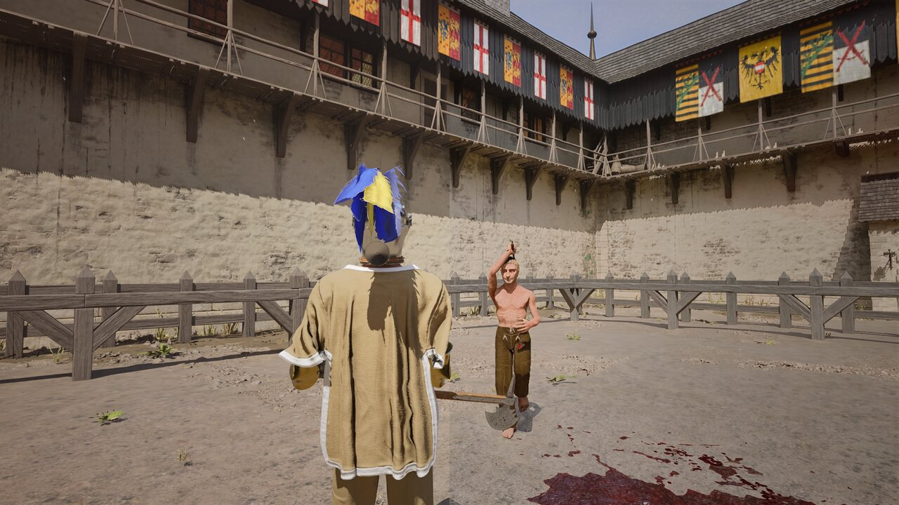
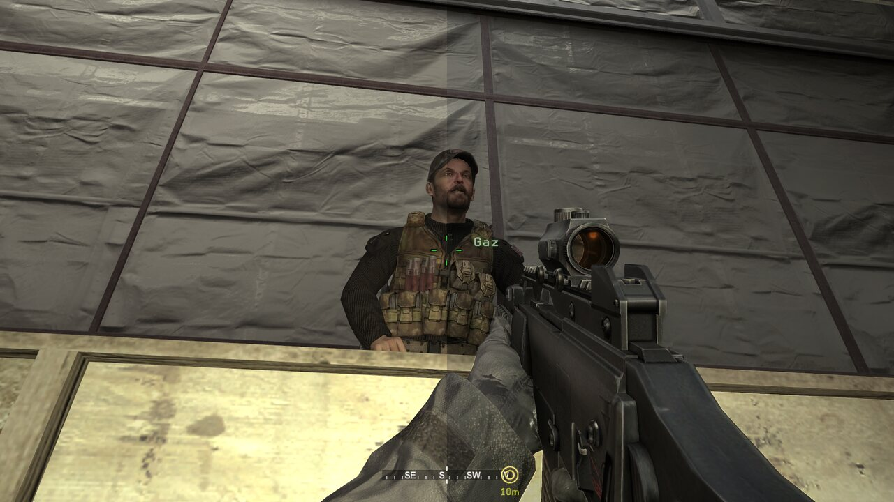
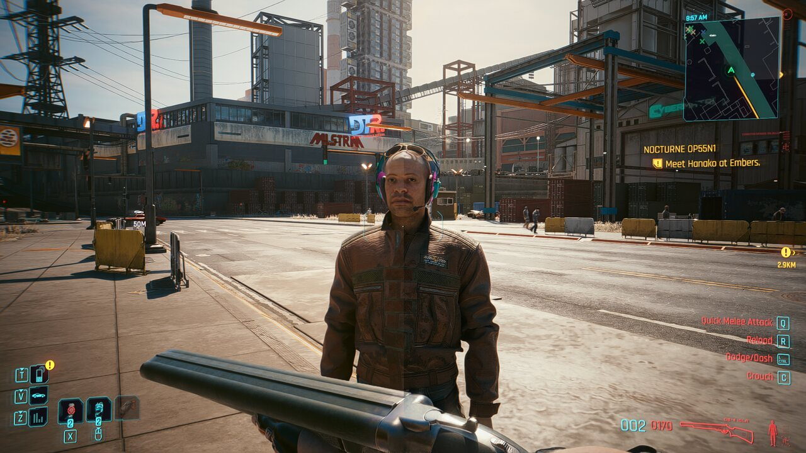

# UniversalDLSS5 v0.4.3

v0.4.3 is the first release of the broader **Universal Renderer Compatibility** work with the UE5 recovery fixes validated far enough to run Half Sword and the legacy D3D9 path validated in Call of Duty 4.

## Highlights

- Added/expanded support for **Direct3D 9, Direct3D 10, Direct3D 11, Direct3D 12, OpenGL and Vulkan**.
- Added **32-bit game support** through Bridge32 + the x64 Feature 18 NRHost.
- Fixed the D3D9/NRHost contract that previously produced a dark edge-only image in Call of Duty 4.
- Reworked late-attach D3D12 recovery for UE5 and other modern engines.
- Fixed the Half Sword `FRenderResource` lifetime crash by preventing recovery mode from retaining transient engine resources.
- Restored game-provided motion/depth in D3D12 recovery without reintroducing UE5 lifetime bugs: short-lived Streamline resources are snapshotted immediately into UniversalDLSS5-owned textures and game-owned references are not retained.
- Restored **1x-4x NR passes** on external-host routes. NRHost IPC ABI 6 now carries requested/executed pass counts and runs reset-only refinement passes using a separate Feature 18 handle and scratch texture.
- Added automatic detach when the target game exits.
- Preserved the existing native D3D11/D3D12 fast paths so already-supported games do not inherit legacy compatibility latency.

## Tested during development

- Half Sword — UE5 / D3D12 recovery
- Call of Duty 4: Modern Warfare — 32-bit D3D9
- Cyberpunk 2077 — D3D12 and native temporal-guide validation
- The Long Drive — D3D11 regression coverage
- Stray — additional modern-game validation

  
  
  

## Notes

UniversalDLSS5 remains experimental. NVIDIA proprietary runtime binaries are not included; import the required official runtime through the controller. Some games, protected processes and unusual presentation paths may still need game-specific compatibility work.

See the main [`README.md`](../README.md) for setup, supported renderers and diagnostics.
